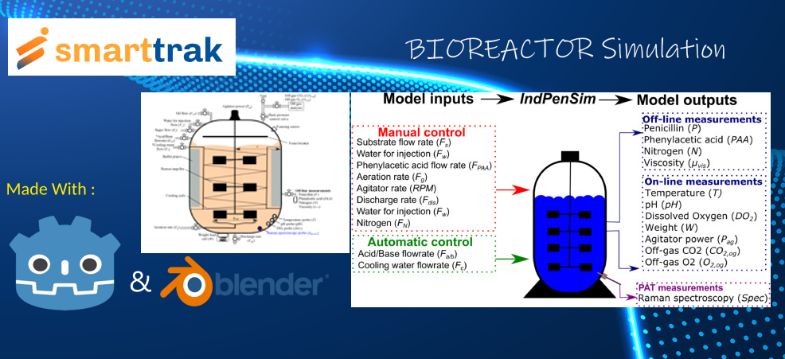

# Bioreactor 3D Simulation Game

## Introduction
This experimental bioreactor game has been made using Godot engine. Its use is to model the operation of a bioreactor using exact simulation logics and APIs connection from a real data source.

Its assets have been created using blender, mesh manipulation and using basic primitive shapes, which are them imported into the godot engine. And then using the gd scripts to write the logics for player movement, hover, and interaction etc.

## How to Run
Download the v3 executable from the release section of this repository

## Playing the simulation game
Once you start the exec you are dropped into the main menu. 

Here you have to click on start simulation, Then you are dropped into a 3D world, The movement is done with keyboard - W, A, S, D keys, spacebar is to jump, and Esc key is to pause the game and go into the pause menu.

To force quit the running application you can use the alt+f4 key.
